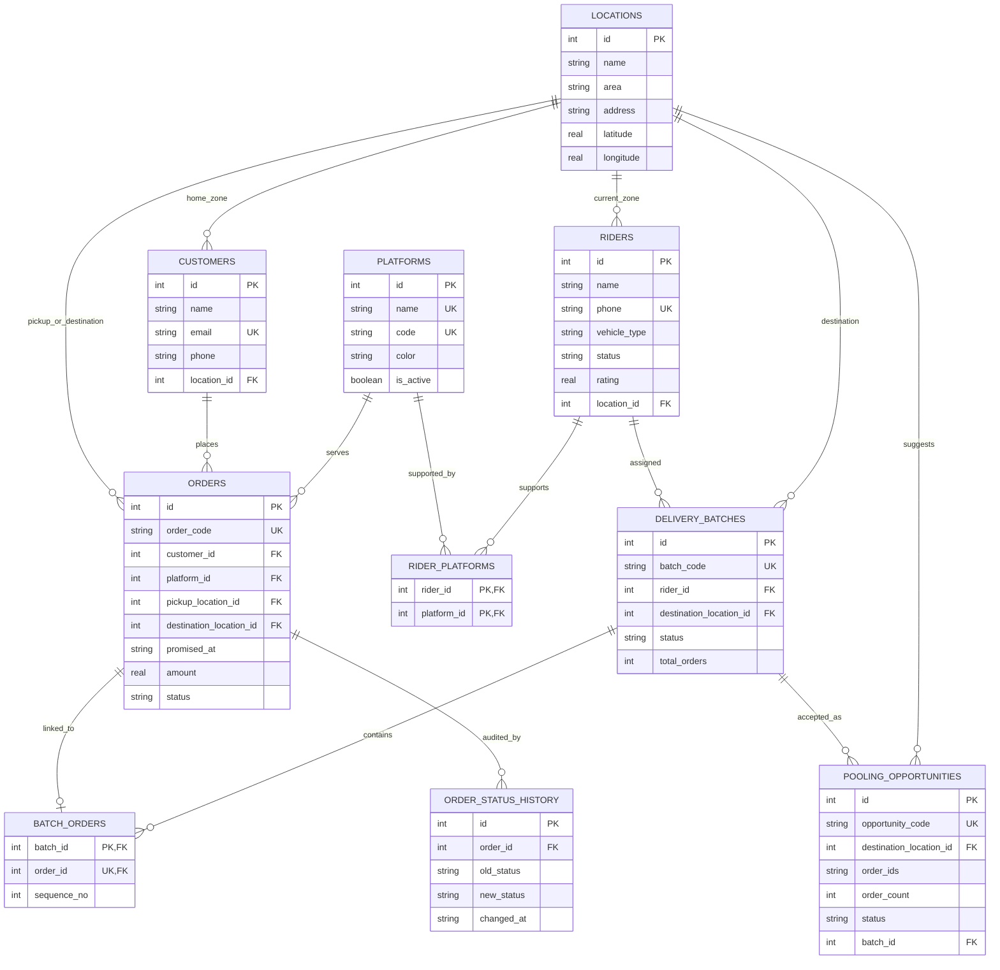

# Entity Relationship Diagram

```mermaid
erDiagram
    PLATFORMS ||--o{ ORDERS : serves
    CUSTOMERS ||--o{ ORDERS : places
    LOCATIONS ||--o{ CUSTOMERS : home_zone
    LOCATIONS ||--o{ RIDERS : current_zone
    RIDERS ||--o{ RIDER_PLATFORMS : supports
    PLATFORMS ||--o{ RIDER_PLATFORMS : supported_by
    LOCATIONS ||--o{ ORDERS : pickup_or_destination
    LOCATIONS ||--o{ DELIVERY_BATCHES : destination
    RIDERS ||--o{ DELIVERY_BATCHES : assigned
    DELIVERY_BATCHES ||--o{ BATCH_ORDERS : contains
    ORDERS ||--o| BATCH_ORDERS : linked_to
    LOCATIONS ||--o{ POOLING_OPPORTUNITIES : suggests
    DELIVERY_BATCHES ||--o{ POOLING_OPPORTUNITIES : accepted_as
    ORDERS ||--o{ ORDER_STATUS_HISTORY : audited_by

    PLATFORMS {
      int id PK
      string name UK
      string code UK
      string color
      boolean is_active
    }
    LOCATIONS {
      int id PK
      string name
      string area
      string address
      real latitude
      real longitude
    }
    CUSTOMERS {
      int id PK
      string name
      string email UK
      string phone
      int location_id FK
    }
    RIDERS {
      int id PK
      string name
      string phone UK
      string vehicle_type
      string status
      real rating
      int location_id FK
    }
    RIDER_PLATFORMS {
      int rider_id PK,FK
      int platform_id PK,FK
    }
    ORDERS {
      int id PK
      string order_code UK
      int customer_id FK
      int platform_id FK
      int pickup_location_id FK
      int destination_location_id FK
      string promised_at
      real amount
      string status
    }
    DELIVERY_BATCHES {
      int id PK
      string batch_code UK
      int rider_id FK
      int destination_location_id FK
      string status
      int total_orders
    }
    BATCH_ORDERS {
      int batch_id PK,FK
      int order_id UK,FK
      int sequence_no
    }
    POOLING_OPPORTUNITIES {
      int id PK
      string opportunity_code UK
      int destination_location_id FK
      string order_ids
      int order_count
      string status
      int batch_id FK
    }
    ORDER_STATUS_HISTORY {
      int id PK
      int order_id FK
      string old_status
      string new_status
      string changed_at
    }
```
